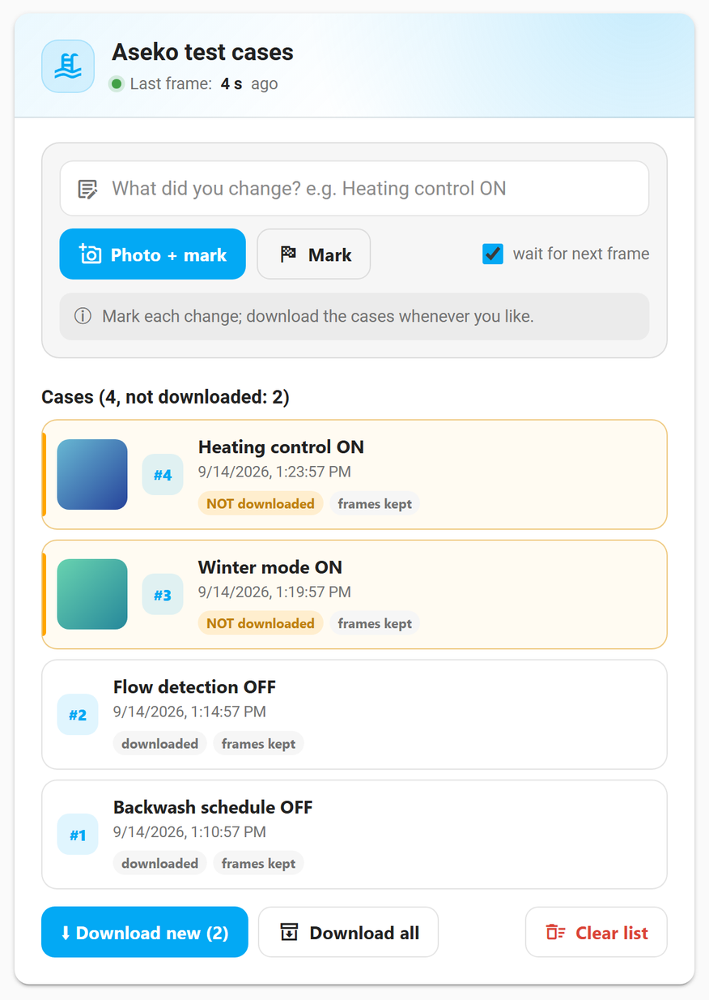

# Aseko Local

[](https://github.com/custom-components/hacs)

## Summary

Local integration for receiving data directly from **Aseko** pool unit without relying on the **[Aseko Cloud](https://aseko.cloud)**. The imported entities depends on your Aseko device model. Here is an example of ASIN Aqua SALT.


The Aseko unit and your Home Assistant need to run on the same network or traffic needs to be allowed to flow from the unit to the configured port (default is **47524**) as the integration relies on direct data stream from the unit.

**Aseko Local** gives you an option to forward reiceived raw data to Aseko Cloud (or anywhere else).

## Device support

### Supported devices

✅ checked on this model · 👁 seen in real frames, not compared with the unit · ❓ assumed, not checked on this model · 🔍 not located in the frame. Per value: [support matrix](docs/support_matrix.md).

| Device | Firmware | Sensors | Pump state | Chemical consumption |
|---|---|---|---|---|
| ASIN Aqua Net | ≤ 7.x | ✅ | ✅ cl, pH− | ✅ cl, pH− |
| ASIN Aqua Net | 8.x | ✅ | ✅ filtration · ❓ cl, pH− | ❓ cl, pH− |
| ASIN Aqua Salt | ≤ 7.x | ✅ | ✅ filtration, electrolyzer, algicide, flocculant · ❓ pH− | ✅ algicide, flocculant · ❓ pH− |
| ASIN Aqua Oxy | ≤ 7.x | 👁 pH, temperature | ✅ filtration, oxy, algicide, flocculant, pH− | ✅ oxy, algicide, flocculant, pH− |
| ASIN Aqua Home | ≤ 7.x | ✅ | ✅ filtration · ❓ cl, algicide, flocculant, pH− | ❓ cl, flocculant, pH− · 🔍 algicide (flow rate not located, not counted) |
| ASIN Aqua Salt NET | 8.x | ❓ | ❓ filtration, pH− | ❓ pH− |
| ASIN Aqua Profi | ≤ 7.x | ❓ no real frame yet | ❓ filtration, cl, flocculant, pH− | ❓ cl, flocculant, pH− |

> **Firmware note:** This integration supports both the **120-byte binary protocol** (firmware ≤ 7.x, port **47524**) and the **text-frame protocol** (firmware 8.x, port **51050**). The port can be changed in the integration settings to match your device.

### Not supported yet

| Device | Status |
|---|---|
| ASIN Aqua Pro | ❔ unit type not mapped: the unit gets no entities, but its frames reach the diagnostics — please share them (see *Help wanted* below) |
| ASIN Aqua Home Pro, Salt Pro, Home Pro Oxy, Eox Pro (07.2026) | ❔ as above |
| ASIN Aqua Net+ | ❔ as above |
| ASIN Aqua | ❌ no network connection |

A value the model does not have gets no entity. A value the unit has not sent yet gets a disabled entity that switches itself on when the value arrives.

### Help wanted — expanding device support

If you own an Aseko unit that is not listed above as fully supported, or the [support matrix](docs/support_matrix.md) shows ❓ for a value on your model, you can help. What we need is simple: the frames your unit sent, and what the unit showed at that moment. The integration can collect both for you.

#### 1. Record test cases with the card (recommended)



**How it works.** While recording is on, the integration keeps a *frame log*: every frame the unit sends, compressed and capped at 256 kB (about five days of frames), kept across Home Assistant restarts. Each time you record a test case, the card writes a *marker* into that log, with your note and, if you like, a photo of the unit's display. Every change you make on the unit then sits right next to the frames that carry it — nobody has to compare clocks, and messengers cannot strip the time from the photos.

Recording is **off** until you turn it on in the card, and it stays the way you left it across restarts and updates. Nothing is recorded while it is off.

Add the card to any dashboard (it is loaded automatically, no resource to add):

```yaml
type: custom:aseko-test-cases-card
```

Then, standing at the unit with your phone:

> **Android:** open the dashboard in **Chrome** (your Home Assistant address, e.g. `http://192.168.1.10:8123`). The Home Assistant app offers only the gallery when the card asks for a photo, even with the camera permission granted; in Chrome **Photo + mark** opens the camera. A photo picked from the gallery works too.

1. **Start recording.** Tap **Recording off** in the header; it turns into **Recording on** with a red dot. **Last frame: N s ago** shows the unit is sending (a v7 unit sends about every 10 seconds). **Photo + mark** and **Mark** work only while recording is on.
2. **Change one setting** on the unit.
3. **Mark it.** Type what you changed, e.g. *Heating control ON*, and tap **Photo + mark** to photograph the display, or **Mark** without a photo. The case is **not** written at the tap: the photo is stored at once, but the marker waits for the next whole frame from the unit (at most 60 seconds), because the unit may not have sent the change yet — with its settings menu open it sends nothing until the menu is closed. Wait for *frame received, go on with the next change* before the next change. When several units send to the same entry, pick the one you are testing in the **Unit** list.
4. **Repeat** for as many changes as you like; switching a setting back is a useful case too. The cases stay in Home Assistant, so the list is the same on the phone and on a PC; the ones not downloaded yet are highlighted.
5. **Download and share.** On any device tap **Download new**: one zip with the frames, the markers, the diagnostics and the photos. Open a new issue at [github.com/hopkins-tk/home-assistant-aseko-local](https://github.com/hopkins-tk/home-assistant-aseko-local/issues/new), say which model and firmware you have, and attach the zip.
6. **Stop recording.** Tap **Recording on** when you are done. What was recorded stays until you delete it.

| Button | What it does |
|---|---|
| **Recording on / off** | starts or stops the frame log; the recorded frames stay either way. Stopping cancels a case still waiting for its frame |
| **Photo + mark** / **Mark** | writes a case after the next frame, with or without a photo of the display |
| **Download new** | a zip with the cases not downloaded yet; they count as downloaded once your browser has the whole zip |
| **Download all** | every case again |
| **Clear list** | empties the list of cases; frames and photos stay |
| **Delete recording** | deletes every recorded frame, case and photo (asks first) |

The card follows the Home Assistant language (English, Slovak, Czech, German, French; `language: en` overrides it). Photos are downscaled to 2048 px and kept in `<config>/aseko_local/photos`, at most 200 photos or 100 MB (the oldest go first). The card and its endpoints are for admin users, like the diagnostics download.

> The frames and the unit's display carry its serial number; check the photos before you attach them to a public issue.

> **Security:** the unit sends its data unencrypted to the port the integration listens on. Keep that port inside your trusted network — do not forward it from the internet. The diagnostics download and the zip export contain the unit's serial number.

**Limits — what is kept and for how long**

| What | Limit | When it is reached |
|---|---|---|
| Frame log | 256 kB compressed, about five days of frames from one v7 unit | the oldest frames are dropped; a marker older than the oldest frame has nothing next to it, so download within a few days |
| Markers (test cases) | 500 | the oldest markers are dropped |
| Photos | 200 photos or 100 MB, 2048 px | the oldest photos are deleted |
| Waiting for a frame | 60 seconds | the case is written without a new frame and the card shows it as an error; check the unit is sending, then record the case again |

- **Downloaded** means your browser received the whole zip. If the download breaks off, the cases stay *new* and **Download new** offers them again.
- Several units sending to one entry share the frame log, so it covers fewer days.
- Bytes that could not be aligned into a frame are counted, with the reason, under `rejected_frames` in the diagnostics, and kept in the log as *rejected* while recording is on.
- A unit whose model the integration does not know gets no entities; it is logged as a warning, its frames are recorded while recording is on, and the diagnostics list it under `unrecognised_devices`, which is exactly what adding it needs.

#### 2. Diagnostics only

1. In Home Assistant go to **Settings → Devices & Services → Aseko Local**
2. Click on your device, then click **Download Diagnostics** (3-dots menu beside settings symbol)
3. Open a new issue at [github.com/hopkins-tk/home-assistant-aseko-local](https://github.com/hopkins-tk/home-assistant-aseko-local/issues/new) and attach the downloaded JSON file

The diagnostics file contains an annotated table of every byte in the last raw data frame sent by your device, and — if recording was on — the frame log with its markers.

#### 3. Without the card: the `aseko_local.mark_dump` action

The card is a front end for this action, so an automation or a dashboard button can write markers too. Call `aseko_local.mark_dump`, optionally with a short `note`; recording has to be on (turn it on in the card), otherwise the action fails. It writes the marker only once the next whole frame has arrived (at most 60 seconds); `wait_for_next_frame: false` writes it at once, and `serial_number` waits for one unit's frame when several send to the same entry. It returns the marker number and how many seconds ago each unit's last frame arrived, and a Home Assistant notification shows *waiting for a frame* and then *written*. `python scripts/frame_log_tool.py DIAGNOSTICS.json --around 1` prints the frames around marker 1.

Which values are read on which model, and which of them still lack a confirming capture, is listed per model in the [support matrix](docs/support_matrix.md). It is generated from the decoder's device profiles, so it is always current; every ❓ in it is a value a recorded test case from that model would settle.

How the decoder is put together (one feature file per value, one profile per model) is described in [Decoding by device profile](docs/decoding-by-device-profile.md). When something looks off, see [Troubleshooting](docs/troubleshooting.md). For contributors: [Adding a model or a value](docs/adding-a-model.md), [Evidence rules](docs/evidence-rules.md) (what ✅ 👁 ❓ 🔍 mean and how a value earns them), and the per-model byte maps in [device analyses](docs/device%20analyzes/).

### Entities that appear later or go unavailable

Every value your model can have gets an entity. One your unit has not shown since Home Assistant started is created **disabled** and switches itself on the first time the unit sends it (Home Assistant reloads the integration for that, so entities may blink once). An entity whose value the last frame did not carry — the accessory is not fitted any more, the shared pump port was routed to the other chemical — is **unavailable** rather than removed, so its history stays. An entity you disabled yourself stays disabled. Note that some settings (water level, heating, variable-speed pump) can be switched on at the unit without the accessory connected; the entity then appears but shows nothing meaningful.

## Installation

### Via HACS - recommended

Use this button to install the integration:

[](https://my.home-assistant.io/redirect/hacs_repository/?repository=aseko-local&owner=hopkins-tk)

### Manual installation

There should be no need to use this method, but this is how:

- Download the zip / tar.gz source file from the release page.
- Extract the contents of the zip / tar.gz
- In the folder of the extracted content you will find a directory 'custom_components'.
- Copy this directory into your Home-Assistant '<config>' directory so that you end up with this directory structure: '<config>/custom_components/aseko_local
- Restart Home Assistant Core

## Configure your Aseko unit

You need to re-configure your Aseko unit to send data to your Home Assistant instance.

### Aseko unit configuration

1. Access your Aseko unit IP address

   - default credentials: **admin**/**admin**

2. Go to **Serial Port** configuration

   
   You can see the default **Remote Srver Address** is **pool.aseko.com** (or something similar) and **Local/Remote Port Number** is **47524** or **51050** - make note of that if you would like to keep sending the data there as well - see [Optional: Keep data to Aseko Cloud](#optional-keep-data-to-aseko-cloud)

   The port shown here tells you which firmware version your device is running:
   - **Port 47524** → firmware v7 or older (120-byte binary frame) — fully supported
   - **Port 51050** → firmware v8 (463-byte text frame) — supported
   But you could change it to whatever you want as long as it matches the port you set in the integration settings.

3. Change **Remote Server Addr** to the IP address or DNS record of your **Home Assistant** instance on your local network (or your TCP mirror - see [Optional: Keep data to Aseko Cloud](#optional-keep-data-to-aseko-cloud))

   

4. Set **Remote Port Number** to the port on which the integration will be listening on your **Home Assistant** instance.

   When adding the **Aseko Local** integration in Home Assistant, set the same port as in your device. The default **47524** works for firmware v7 devices. For firmware v8 devices the default is **51050**.

   > **Mixed setup (two devices, different firmware):** Both devices must send to the **same** port on Home Assistant — the integration uses a single server. Choose one port, set both devices to use it, and set the same port when configuring the integration.

5. Confirm the **Restart** of the module

   

### Optional: Send data to Aseko Cloud

If you want to keep sending the data to Aseko Cloud, you had to use a TCP proxy (like [goduplicator](https://github.com/hopkins-tk/home-assistant-aseko-local/issues/14#issuecomment-2897932015)) before release `1.3.0`. The installation and configuration of goduplicator proved trouble some for some of the users and goduplicator has not been updated for over 5 years.

**Aseko Local** has a built in forwarder that can be enabled to forward the raw data received from Aseko Device to Aseko Cloud. To use it, open **Aseko Local** integration, click on settings (see image) and enable the forwarder.

> The forwarder automatically selects the correct destination port based on the frame type received:
> - **Firmware v7 and older** (binary frame) → forwards to `pool.aseko.com` port **47524**
> - **Firmware v8** (text frame) → forwards to `pool.aseko.com` port **51050**
>
> No additional configuration is needed.


## Chemical consumption & canister management

Supported devices report how much chemical each dosing pump has dispensed. The integration exposes two consumption sensors per pump:

- **Since last reset** (`*_since_reset`) — resets to zero when you refill the canister and trigger a reset.
- **Total** (`*_total`) — a running lifetime total that never resets automatically.
- **Reset Button** — a dashboard button to reset the *since last reset* counter after refilling a canister.
- **Pump state** — the integration also decodes pump states (on/off) from the raw data, so you can track when pumps are running in real time and you can analyze the history like how often and how long running.
- **Other information** like canister fill-up volume and remaining volume can be tracked using standard Home Assistant helpers and templates — see below for details.

Here is an example of the consumption sensors and canister settings in Home Assistant:


### Resetting the canister counter

After refilling a chemical canister trigger a reset so the *since last reset* counter starts from zero again.

**Option 1 – Dashboard button**

Add a **button card** or an **entity card** and choose the button entity ***_refill_reset** (see image above).

**Option 2 – Developer Tools**

Go to **Developer Tools → Actions**, search for `aseko_local.reset_consumption` and call it with the pump you refilled (or `all`) and counter `canister`. With this method you can also reset the *total* counter, which is not possible with the dashboard button.


### Optional: Track remaining canister volume

Aseko's own app counts down the remaining chemical volume in a canister. You can replicate this in Home Assistant using two standard helpers.

**Step 1 – Number helper for fill-up amount**

Go to **Settings → Devices & Services → Helpers → Create helper → Number** and create one helper per chemical, e.g.:

| Field | Example value |
|---|---|
| Name | PH Minus fill-up |
| Minimum | 0 |
| Maximum | 25 |
| Step | 0.1 |
| Unit of measurement | L |

When you refill the canister, update this helper to the volume you actually added before triggering the reset.


**Step 2 – Template sensor for remaining volume**

Go to **Settings → Devices & Services → Helpers → Create helper → Template → Template sensor** and configure it as follows:

| Field | Example value |
|---|---|
| Name | PH minus remaining fill |
| State template | `{{ states('input_number.ph_minus_fill_up')\|float(0) - states('sensor.ph_minus_since_reset')\|float(0) }}` |
| Unit of measurement | L |
| Device class | Volume |

Adjust the entity IDs to match your own helper and sensor names.


**Step 3 - Issue utility meter for periodic usage like daily/weekly/monthly consumption**
Go to **Settings → Devices & Services → Helpers → Create helper → Utility Meter** and configure it as follows:
- Name: PH minus daily usage
- Meter type: Daily
- Source entity: sensor.ph_minus_total (or sensor.ph_minus_since_reset, depending on your preference)
- reset on: midnight (for daily), or the first day of the month (for monthly), etc.
- Device class: Energy (or None, depending on your preference)
- Unit of measurement: L

**Step 4 – Add everything to a dashboard card**

Combine the fill-up number input, the *since last reset* sensor, the remaining volume template sensor, and a reset button into a single dashboard card for a complete canister management view.
## Water level (ASIN Aqua Home, Salt, Oxy)

Devices with a built-in water-level sensor expose the following entities:

| Entity | Unit | Description |
|---|---|---|
| `sensor.water_level` | cm | Current water level (real-time) |
| `binary_sensor.water_filling_active` | — | `True` while the auto-fill valve is open |
| `sensor.water_level_low_alarm` | cm | Low-level alarm threshold |
| `sensor.water_level_filling_on` | cm | Threshold that opens the auto-fill valve |
| `sensor.water_level_filling_off` | cm | Threshold that closes the auto-fill valve |
| `sensor.water_level_high_alarm` | cm | High-level alarm threshold |

The raw sensor value reports the **distance from the sensor to the water surface** in centimetres. This matches what the Aseko Live app shows, so no further adjustment is needed for a standard installation.

### Optional: Correct the reading with an offset helper

If your sensor is mounted at a different height than the Aseko factory default (e.g. relocated, installed in a skimmer with an unusual standoff), the displayed centimetres will be off by a constant. You can apply a fixed offset using a Home Assistant template helper.

1. **Settings → Devices & Services → Helpers → Create helper → Number** named *Water level offset* with unit `cm`, min `0`, max `+250`, step `1`. Default value `0`.
2. **Settings → Devices & Services → Helpers → Create helper → Template sensor**:

   | Field | Value |
   |---|---|
   | Name | Pool water level (corrected) |
   | State template | `{{ states('sensor.aseko_local_water_level')\|float(0) + states('input_number.water_level_offset')\|float(0) }}` |
   | Unit of measurement | cm |
   | Device class | Distance |

This mirrors the same pattern used for canister volume in the previous section and works for any device that exposes `sensor.<device>_water_level` (HOME, SALT, OXY). Devices without a water-level sensor (e.g. NET) will simply not have these entities.

## Backwash (ASIN Aqua Home, Salt, Oxygen, Profi)

The device transmits its backwash **configuration** and the live state of the backwash valve, but never its history — it does not report when the last cycle ran. The integration therefore watches the valve itself and builds the history from what it observes.

Configuration read straight from the frame:

| Entity | Description |
|---|---|
| `sensor.backwash_every_n_days` | Interval in days (`0` = automatic backwash disabled) |
| `sensor.backwash_time` | Scheduled start time (HH:MM) |
| `sensor.backwash_duration` | Duration in seconds |
| `binary_sensor.backwash_active` | Valve is open right now |

History, recorded live and persisted across restarts. **These are not all equally reliable** — see below:

| Entity | Description | Timestamp | Which bucket it lands in |
|---|---|---|---|
| `sensor.last_backwash` | Last cycle, whatever started it. **Unknown** until one is seen | Observed | n/a — it holds every cycle |
| `datetime.last_scheduled_backwash` | Last cycle that looked like the unit's own scheduled run — **and settable**, see below | Observed *or* entered by hand — see its `source` attribute | Estimated |
| `sensor.last_manual_backwash` | Last cycle that did not | Observed | Estimated |
| `sensor.next_scheduled_backwash` | Projected next automatic cycle. **Unknown** until a scheduled cycle is known | **Calculated** | Inherited |

The two columns matter separately. A cycle the integration watched has an exact
timestamp — what is estimated is only *which* of the two buckets it belongs in.
Only `next_scheduled_backwash` holds a timestamp that was computed rather than
measured, which is why it is the one carrying "(estimated)" in its name.

### Observed vs. estimated

A cycle is **recorded** when the backwash valve stays open for at least 60 seconds — short activations (menu navigation, output test mode) are ignored. That part is a direct observation: `sensor.last_backwash` means the valve really did run a full cycle.

The device does **not** report *why* the valve opened. So the split into scheduled and manual is a guess based on the only signal available — the time the valve opened:

* within **±15 minutes** of `backwash_time`, on a unit whose schedule is enabled → **scheduled**;
* anything else, including any cycle on a unit with `backwash_every_n_days = 0` → **manual**.

The tolerance absorbs drift between the unit's clock and Home Assistant's, plus up to one transmit interval (~30 s) of lag before the frame reports the valve as open.

`next_scheduled_backwash` is projected from the last **scheduled** cycle: that timestamp plus the configured interval, snapped to `backwash_time`, and stepped forward if cycles were missed while Home Assistant was down. A manual backwash deliberately does not move it — starting one by hand does not tell us (nor, on the unit, change) the schedule phase. Since it builds on the classification, it inherits any error in it.

> **Upgrading:** `sensor.next_backwash` was renamed to `sensor.next_scheduled_backwash`. The integration rewrites the entity registry on startup, so the entity keeps its `entity_id`, its recorded history and any automation or dashboard pointing at it — only the displayed name changes.

### Seeding the schedule by hand

Because the device never transmits its history, `next_scheduled_backwash` stays unknown until the integration has watched a whole scheduled cycle — up to a full interval of waiting.

To skip that wait, **click `datetime.last_scheduled_backwash` and pick the date** in the dialog. That is why it is a `datetime` entity rather than a read-only sensor: no helper, no script, no confirm button.

The same thing from an automation:

```yaml
action: aseko_local.set_last_scheduled_backwash
data:
  timestamp: "2026-08-01 12:30:00"
  # serial_number: 110071590   # optional; omit to set every backwash-capable device
```

The timestamp must be in the past. `datetime.last_scheduled_backwash` carries a
`source` attribute saying where its value came from:

| `source` | Meaning |
|---|---|
| `observed` | The integration watched this cycle run |
| `manual` | You entered it |

`next_scheduled_backwash` has no `source` of its own — it is always projected
from `last_scheduled_backwash`, so that sensor's `source` covers both.

**The last write wins, and the stored timestamps are never compared.**

* Entering a date always applies, whatever it is and whatever was there
  before — if you are typing it in, you have a reason to.
* A scheduled cycle detected *after* that entry replaces it, and the source
  flips back to `observed`. The value you entered stood in for a real cycle
  until one turned up; one has.

So a seed is only ever overtaken by an actual observation, never by an older
record, and you can always take control back by entering a date again.

Seeding deliberately does **not** touch `sensor.last_backwash`: that one means
"the integration watched this happen", and a typed-in date has not been
watched. It also does not touch `last_manual_backwash`, which tracks *observed*
cycles that were started by hand — a different thing from a manually entered
date.

To undo a mistyped date there is `aseko_local.clear_last_scheduled_backwash`,
which returns the value to unknown (optionally for one `serial_number`). If an
older cycle is on record, clearing also re-derives the split from it — see
below.

### Upgrading from a store that predates the split

`last_scheduled_backwash` and `last_manual_backwash` are newer than
`last_backwash`, so an existing install has a stored cycle but no record of
which kind it was. Rather than leave both empty until the next cycle — up to a
whole interval away — the integration classifies that stored timestamp against
the schedule on the first frame after the upgrade, and fills in whichever of
the two it belongs to. It only ever does this while both are empty, so a real
cycle is never second-guessed.

### Known ways the estimate gets it wrong

* A cycle you start **by hand near the scheduled time** is reported as scheduled.
* Only the **time of day** is checked, not the day itself. A manual cycle at exactly `backwash_time` on a day the interval does not fall on still counts as scheduled. (Checking the day would require knowing the schedule phase — which is exactly what this is trying to establish — and would break whenever you change the interval.)
* If the unit's **clock drifts** more than 15 minutes from Home Assistant's, its own scheduled cycles are reported as manual.
* A cycle the unit runs on its own **for some other reason** (e.g. after a fault) is reported as manual.
* Classification uses the schedule **as it was at the time of the cycle** and is never revisited — changing `backwash_time` later does not reclassify history.

If a cycle looks misclassified, the integration's diagnostics download carries `last_backwash_trigger` alongside the raw frame, so you can see what it decided and open an issue.

> **Note:** all four history sensors read "unknown" on a fresh install and stay that way until the integration actually sees a cycle. This is intentional. Earlier versions derived `last_backwash` from the schedule, which showed a confident timestamp for a backwash that may never have happened.
