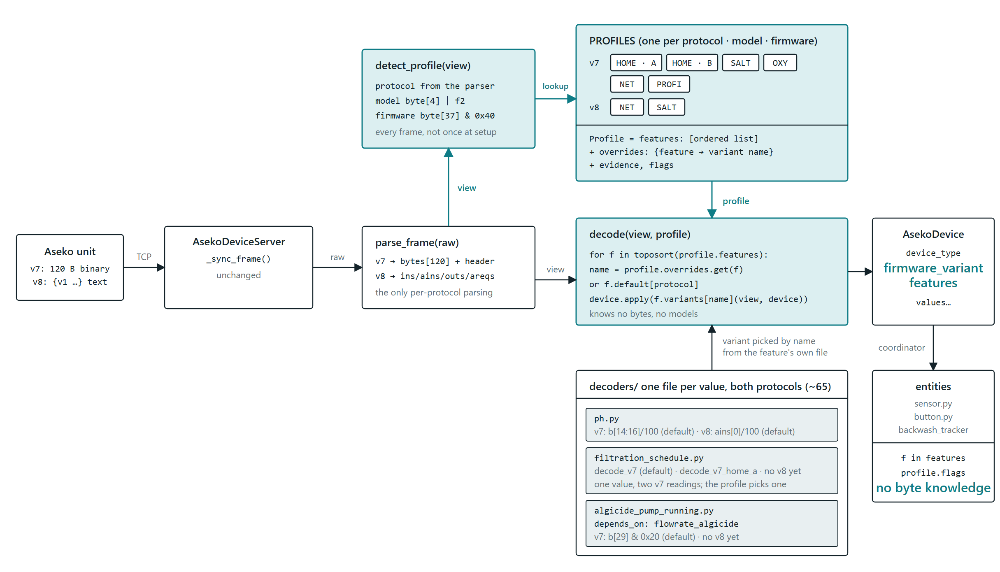

# Decoding by device profile

How frames from Aseko pool units are turned into sensor values, why the decoder is organised by device profile, and what that replaced.  The [support matrix](support_matrix.md) generated from the profiles says which values are read on which model.

## What a frame tells us

Every frame carries three things that decide how the rest of it must be read. They are layered: the protocol decides where the model byte is, the model decides which features exist, and on one model the firmware decides how a byte is encoded.

| Layer | Values | Where it comes from |
|---|---|---|
| 1 · protocol | v7 binary, v8 text | 120-byte frame on port 47524, or a text frame starting with `{v1 ` on port 51050. Detected by the server from the first bytes. |
| 2 · model | HOME, NET, OXY, PROFI, SALT | v7: `byte[4]`. v8: header field `f2`. Decides which outputs exist (filtration, backwash, filling valve, electrolyser) and which bytes carry them. |
| 3 · firmware variant | HOME A, HOME B | Same bytes, different encoding of `byte[37]`. Discriminated by bit `0x40`. The frame carries no firmware number, so this is inferred from content. *Update:* the HOME A / B split turned out to be the Waterlevel setting, not a firmware; no model has a firmware variant today. |

Every variant has to be kept forever: units in the field do not get firmware updates, and each new Aseko model adds another one.

## Before the profiles

Layer 1 was clean: the server picks a decoder and both decoders produce the same `AsekoDevice`. Layer 2 lived inside the v7 decoder as `if device_type == …` branches in about twelve methods, plus four capability sets and one mask table. Layer 3 did not exist as a concept: it was a single inline bit check, and the result was not stored anywhere.


Friction points:

1. **Firmware is not a concept.** The HOME A / B split is one inline bit test in `_fill_filtration_schedule`. Masks named `HOME_FWA_*` are applied to every HOME regardless of variant.
2. **The device object cannot say what it is.** No firmware variant, no list of supported features. Diagnostics cannot show which decoding path was taken.
3. **The entity layer knows about bytes.** `sensor.py` and `button.py` import `ACTUATOR_MASKS` to decide pump presence. For a v8 unit this returns v7 masks the v8 frame does not have.
4. **Model semantics leak into logic.** `backwash_tracker` checks `device_type is SALT` because bit `0x04` means something else on HOME B. That fact belongs next to the model, not in the tracker.

## The design

Three building blocks, all under `custom_components/aseko_local/decoding/`:

- A **feature** is one target value: one field on `AsekoDevice`. pH is one feature, chlorine is another, `filtration_period_2_start` is another. That is about 65 features for the frame-derived fields we have today.
- Each feature has one **decoder file** in `decoders/` that holds every known way to read it, its *variants*, for v7 and v8 alike, with one default per protocol. A feature declares `depends_on` for features it needs first. A feature file knows nothing about models.
- A **profile** is one (protocol, model, firmware) combination: an ordered list of the features it has, `overrides` naming a different variant for the few features it reads differently, `evidence` for each feature, and semantic flags. Model knowledge lives here only.

The decoder becomes a generic loop. The only protocol-specific code left is a frame parser.



### Where the "this profile reads it this way" logic lives

The feature file holds the *how*, the profile holds the *which*. Filtration pump state as the example:

```python
# decoders/filtration_running.py — one value, knows nothing about models
class FiltrationRunning(Feature):
    field = "filtration_running"
    depends_on = (ServiceMenuOpen,)

    def decode_v7(self, frame, device):               # default: the relay bit
        return bool(frame[29] & 0x08)

    def decode_v7_menu_override(self, frame, device):  # HOME: the menu stops the pump
        if device.service_menu_open:
            return False
        return bool(frame[29] & 0x08)

    def decode_v8(self, frame, device):
        return bool(frame.get("outs", 2))
```

```python
# profiles/v7/common.py — only what the v7 models share
FILTRATION = (FiltrationPeriod1Start, ..., FiltrationSchedule, FiltrationRunning)

# profiles/v7/home.py — one module per model, the only place that knows it
HOME = Profile(
    protocol=V7, model=HOME,
    features=(*IDENTITY, ..., *FILTRATION, ServiceMenuOpen, ...),
    overrides={FiltrationRunning: "decode_v7_menu_override"},
    evidence={FiltrationRunning: "confirmed: byte[29] 0x08 stays set under the override (Issue #133)"},
)

# profiles/v7/salt.py
SALT = Profile(
    protocol=V7, model=SALT,
    features=(..., *FILTRATION, ...),              # decode_v7 by default
    flags={MENU_BIT_IS_PRESENCE_ONLY},             # read by backwash_tracker
)

# profiles/v7/net.py
NET = Profile(
    protocol=V7, model=NET,
    features=(*IDENTITY, *CHLORINE_PROBES, ..., *ALARMS),   # no FILTRATION
)
```

| profile | FiltrationRunning listed? | override? | variant used | example |
|---|---|---|---|---|
| v7 · SALT | yes | no | `decode_v7` (default): `byte[29] & 0x08` | `0x18` → running |
| v7 · HOME | yes | **yes** | `decode_v7_menu_override`: off while the menu is open | `byte[37] 0x04` → off |
| v7 · NET | no (no filtration output) | — | never called | field stays `None` |
| v8 · NET | yes | no | `decode_v8`: `outs[2]` | `1` → running |

So: for a feature read the same way everywhere, the answer is the default variant in its file. For a feature that differs, the answer is one line in that profile's `overrides`. For a feature a model does not have, the answer is its absence from that profile's `features`.

## What changes, what stays

| concern | today | proposed |
|---|---|---|
| Protocol detection | `_sync_frame` finds `{v1 ` or rewinds 120 B | unchanged |
| Frame parsing | inside each decoder | `parse_frame`: v7 bytes view, v8 sections view |
| Model detection | `_unit_type()` in v7, header `f2` in v8 | same rules, moved into `detect_profile` |
| Firmware variant | inline bit test, HOME only, not stored | part of the profile key; stored on `AsekoDevice`; visible in diagnostics |
| Which features a model has | four `*_TYPES` sets + `ACTUATOR_MASKS` + `byte37_routes_pump_type` | one ordered `features` list per profile |
| How a model reads a feature | `if device_type == …` inside each `_fill_*` | variants in the feature's file, default per protocol; the profile names an override |
| Pump presence for entities | `sensor.py` / `button.py` import v7 masks | `feature in device.features` |
| Whether an entity is created | the first frame's value is not None | the field is in `device.features`: the model reads it *and* this unit has it; a None value then shows as "unknown" |
| Meaning of `byte[37]` bit 0x04 | `device_type is SALT` check in `backwash_tracker` | profile flag, tracker reads the flag |
| v8 decoding | separate decoder, one layout | same loop and same feature files; a v8 frame parser plus v8 variants inside each feature |
| Public entry point | `AsekoDecoder.decode(bytes)` | kept, so the ~80 decoder tests stayed the regression oracle |

## Three things the design has to respect

**Detection is per frame, not once.** The model byte is reliable in every frame, and settings such as the menu bit in `byte[37]` change from frame to frame (and are often `0xFF`). Detect every time, never lock a profile on the first frame.

**Features depend on each other.** Algicide pump state is only read when its flow rate was present. Filtration pump state on HOME B depends on `service_menu_open`. Setpoints depend on the probe configuration. Variants receive the partially filled device, and each feature declares `depends_on` so the loop can sort them. Registration by import order would lose that.

**Probe configuration is a third axis, not a profile.** `byte[53]` is one of four setpoints depending on which probes the unit has, and that is per unit, not per model. Profiles list all four as possible; the reading answers `NOT_PRESENT` for the ones this unit lacks.

## Three states, not two

A reading can answer with a value, with `None`, or with `NOT_PRESENT` (see `decoding/presence.py`). The engine drops `NOT_PRESENT` fields from `device.features` and stores None; a `None` answer keeps the field in `features`. The entity layer creates an entity for every field in `features` and nothing else, so:

- a model that lacks a quantity (NET has no filtration) never gets the entity, because no NET profile lists the feature;
- a unit that lacks it (a SALT with a REDOX probe has no free chlorine; a shared pump port routed to flocculant has no algicide) never gets the entity, because the reading answered `NOT_PRESENT`;
- a unit that has it but whose first frame could not say (a SALT sending `byte[37] = 0xFF` at startup) gets the entity in state "unknown" instead of no entity until the next reload.

Presence is sticky and entities can arrive late. The coordinator keeps a device's feature set as the union of everything the unit has ever shown, and when a frame adds to it (the shared port gets configured, a setting is made) it calls the platforms' new-features listeners with just the added fields. Each platform builds the entities for those fields and nothing else, so a quantity that only becomes present after the device was first seen still gets its entity, without a reload. Entities are never removed: a quantity that stops being readable keeps its entity and shows "unknown".

HOME used to have a firmware A and B profile, told apart by `byte[37]` bit 0x40. That bit turned out to be the Waterlevel setting, so one HOME profile reads every HOME frame and the bit is a value of its own.

A frame whose `byte[4]` maps to no model decodes with a profile that reads everything that has a generic v7 reading. It gets no entities, since nothing about it is verified, but the coordinator keeps it aside and the diagnostics download reports it under `unrecognised_devices` with the annotated raw frame and those generic values, which is what adding the model needs. Neither fallback profile appears in the support matrix tables, because no unit is meant to decode with them.

## Generated support matrix

Because every profile carries `features`, `overrides` and `evidence`, a script can render a feature × profile matrix (confirmed / unconfirmed / not present, with the issue or serial that confirmed it). Every "unconfirmed" cell is a concrete request for a diagnostics dump, linkable from the README. Run it in CI as a check that fails when the committed matrix is out of date, rather than as a bot commit. The existing `docs/device analyzes/*.md` remain the evidence narrative the matrix links to.

## How the refactor was verified

The v7 decoder was 939 lines with about 80 tests. The entry points stayed, so those tests ran unchanged against the new engine, and a differential run decoded every captured frame plus twenty thousand random mutations of them through both implementations without a single differing field. The steps below were the plan; they were carried out as one change.

1. **Add `Feature`, `firmware_variant` and `detect_profile`.** No decoding changes yet. Diagnostics start showing which profile was chosen, useful on its own for triaging user dumps.
2. **Fold the four `*_TYPES` sets and `ACTUATOR_MASKS` into profiles.** The decoder reads them from the profile instead. Pure relocation, no behaviour change.
3. **Move pump presence and the SALT check out of the entity layer.** `sensor.py`, `button.py` and `backwash_tracker` stop importing v7 helpers. The v8 mask mismatch disappears with it.
4. **Cut `_fill_*` and the v8 decoder body into feature files and switch to the loop.** Feature by feature, running the decoder tests after each move. Overrides appear only where a test proves a model reads differently.

Layout, all under `custom_components/aseko_local/decoding/`: `decoders/<field>.py` (one per target value, both protocols inside; 64 files), `profiles/v7/` and `profiles/v8/` (one module per model with its `evidence`, plus `common.py` for what the models of a protocol share and `__init__.py` for the model lookup), `frame.py` (the two parsers), `profile.py` (the `Profile` class and detection helpers), `engine.py` (the loop) and `support_matrix.py` (renders `docs/support_matrix.md`).  `aseko_decoder.py` and `aseko_decoder_v8.py` remain as thin facades.
