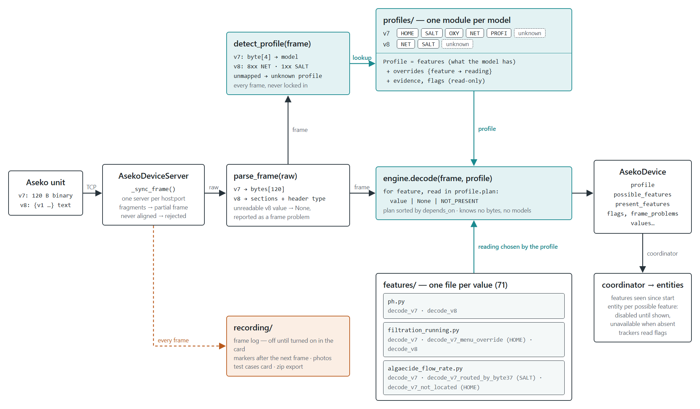
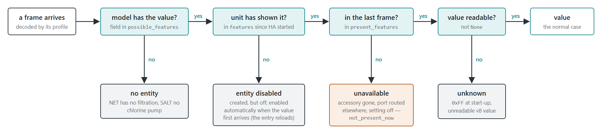
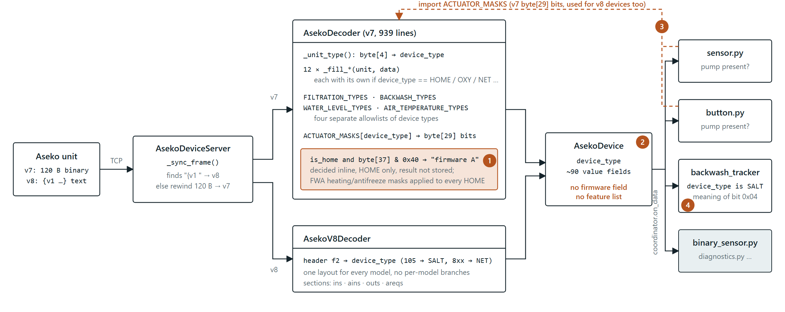

# Decoding by device profile

How frames from Aseko pool units become Home Assistant entities. The
[support matrix](support_matrix.md), generated from the profiles, says which
values are read on which model. Short guides: [Troubleshooting](troubleshooting.md), [Adding a model or a value](adding-a-model.md),
[Evidence rules](evidence-rules.md). Per-model byte maps: [device analyses](device%20analyzes/).

## Overview



The picture is generated from [`images/src/aseko-architecture.html`](images/src/aseko-architecture.html).

| Package / module | Responsibility |
|---|---|
| `server.py` | One TCP server per host:port (`AsekoDeviceServer`). Aligns the stream into v7 (120 bytes) or v8 (`{v1 …}`) frames; a fragment is kept as a partial frame, bytes it cannot align are counted in diagnostics as `rejected` (and logged while recording). Optionally forwards every frame to Aseko Cloud (`forwarder.py`). |
| `decoding/` | Bytes → `AsekoDevice`. No entities, no coordinator; from Home Assistant it uses only the time zone helpers, for the unit's clock and a missing timestamp. |
| `coordinator.py` | Keeps the latest `AsekoDevice` per serial, merges feature sets, notifies platforms, owns the frame log and consumption store, waits for frames for `mark_dump`. |
| `entity.py` + platforms | Entities for every value the model can have (see [Entity lifecycle](#entity-lifecycle)). |
| `trackers/` | State the frame does not carry: backwash history and schedule restarts, chemical consumption (exact ml, HA Store), the unit clock offset and its out-of-sync alert (`clock.py`, not stored). |
| `recording/` | Frame log with markers, photos, HTTP views and the test cases card. |
| Times | The server stamps each frame when it is complete (`received_at`, UTC); `last_seen`, `last_backwash` and `last_manual_backwash` are that Home Assistant time, the transmission delay not corrected. `unit_clock` is what the unit sent; `clock_offset` is it minus Home Assistant's local time. `last_scheduled_backwash` and `next_scheduled_backwash` are on the unit's clock. Every stored time carries its zone; durations, gaps and freshness are computed normalised to UTC. |
| `diagnostics.py` | Per unit: annotated raw frame, `profile`, `reading_overrides`, `frame_problems`, `possible_features`, `not_present_now`, frame warnings. For the entry: unrecognised units, rejected frames, `frame_log_enabled`, frame log. |

## The decoding package

```
decoding/
  __init__.py      decode(raw, protocol=None) — the one entry point
  frames/          parse_frame: v7.py (120-byte view), v8.py (sections + problems), values.py, protocol.py
  feature.py       Feature base class, NOT_LOCATED readings
  features/        one file per AsekoDevice field, ALL_FEATURES (the support matrix lists them)
  profile.py       Profile class, v7 unit type → model
  profiles/
    __init__.py    ALL_PROFILES, FALLBACK_PROFILES, detect_profile, profile_named
    v7/            common.py (shared feature groups) + home, salt, oxy, net, profi, unknown
    v8/            common.py (shared layout) + net, salt, unknown; header type → model
  presence.py      NOT_PRESENT
  evidence.py      Evidence: confirmed / derived / confirmed_on / observed / assumed / not_located
  engine.py        the generic loop
  support_matrix.py  renders docs/support_matrix.md
```

### What a frame tells us

| Layer | Values | Where it comes from |
|---|---|---|
| protocol | v7 binary, v8 text | 120-byte frame (port 47524) or text frame starting `{v1 ` (port 51050), recognised by the server. |
| model | HOME, NET, OXY, PROFI, SALT | v7: `byte[4]` unit type (also carries the probe configuration). v8: the header type, which is product line + firmware version: 8xx = NET (804, 805, 812), 1xx = Salt NET (105). |

The firmware version does not select a layout today. If a version ever needs
one, it is one more branch in the model's detection, not a new concept.
Detection runs on **every frame**; a profile is never locked in.

An unmapped v7 unit type or v8 header type decodes with the `unknown` profile
of its protocol: generic readings, no model, **no entities**, a warning in the
log, and an `unrecognised_devices` entry in diagnostics with the annotated raw
frame. The fallback profiles are not in the support matrix.

### Features and readings

A **feature** is one field on `AsekoDevice`. Its file holds every known way to
read it — its *readings* — for both protocols: `decode_v7` and `decode_v8` are
the defaults, named readings (`decode_v7_oxy`, `decode_v7_menu_override`,
`decode_v7_routed_by_byte37`, `decode_v7_winter_mode`, …) cover models that
differ. `decode_v7_not_located` / `decode_v8_not_located` stand for a value the
model has but whose place in the frame is unknown. A feature declares
`depends_on` (and `optional_depends_on`) for values it needs first; the profile
sorts its plan by them. A feature file knows nothing about models.

```python
# features/filtration_running.py
class FiltrationRunning(Feature):
    field = "filtration_running"
    depends_on = (ServiceMenuOpen,)

    def decode_v7(self, frame, device):               # default: the relay bit
        return bool(frame[29] & 0x08)

    def decode_v7_menu_override(self, frame, device):  # HOME: the menu stops the pump
        if device.service_menu_open:
            return False
        return bool(frame[29] & 0x08)
```

### Profiles

A **profile** is one (protocol, model) combination in its own module:

- `features` — what the profile reads (groups from `common.py`); a missing feature is one the model does not have, or one nobody has decoded yet;
- `overrides` — the reading to use where this model differs from the protocol default;
- `evidence` — why each entry is believed, spelled out per profile as `confirmed(...)`, `observed(...)`, `assumed(...)` … from `evidence.py`, whose status sets the support-matrix mark ([rules](evidence-rules.md));
- `flags` — model facts consumers need, instead of `device_type` checks: `MENU_BIT_IS_PRESENCE_ONLY` (read by the backwash tracker and the `service_menu` state of Connection status; adding it to a profile turns both on for that model), `DELAYS_IN_MINUTES` (v8 delays, read by `sensor.py`).

A profile is validated and its plan built once, at import; `overrides` and `evidence` are read-only afterwards. A profile changes by editing its module, never in memory.

```python
# profiles/v7/home.py (abridged)
HOME = Profile(
    name="v7 HOME", protocol=Protocol.V7, model=AsekoDeviceType.HOME,
    features=(*IDENTITY, ..., *FILTRATION, ServiceMenuOpen, ...),
    overrides={
        Configuration: "decode_v7_by_unit_type_byte",
        FiltrationRunning: "decode_v7_menu_override",
        AlgaecidePumpRunning: "decode_v7_oxy",
        AlgaecideFlowRate: "decode_v7_not_located",
    },
    evidence={...},
)
```

The feature file holds the *how*, the profile the *which*: a value read the
same everywhere uses the default; a value that differs is one line in
`overrides`; a value a model lacks is absent from `features`.

### Three answers: value, None, NOT_PRESENT

The engine walks the profile's plan and calls each reading with the frame and
the device filled so far. A reading answers:

- a **value**;
- **None** — the unit has it, this frame cannot say (e.g. `byte[37] = 0xFF` at start-up);
- **`NOT_PRESENT`** — this unit does not have it (a REDOX probe instead of CLF, the shared pump port routed to the other chemical). The field is stored as None and left out of the frame's features.

Probe configuration is per unit, not per model, so it is handled this way
rather than with more profiles: `byte[53]` is one of four setpoints and the
profile lists all four.

The engine sets on the device: `profile` (the name of the profile that read
the frame), `possible_features` (every field the profile reads),
`present_features` (present in this frame) and `frame_problems` (what the
parser could not read). The coordinator keeps `features` as the union of
everything the unit has shown since Home Assistant started.

### Frames the parser refuses or only partly reads

- **v7** must be exactly 120 bytes; anything else is a `ValueError`. The server
  never decodes a fragment — it keeps it as the partial frame for diagnostics.
- **v8**: an unparseable header is a `ValueError` (counted as `v8 frame
  rejected`). A value that is not a number reads None and the rest of its
  section stands; it and any missing `ins` / `ains` / `outs` / `areqs` section
  become `frame_problems`, which the server logs and counts. `crc16` is read as
  hex but not checked — its algorithm is not known.
- An unfilled `0xFF` / `0xFFFF` (v8: `-500`) is never a number. What it means
  is decided per field in its feature file: a measurement or a setpoint of a
  fitted probe reads None (unknown); a setting never made or an input not
  fitted reads `NOT_PRESENT`. In v8 only `-500` marks a probe as absent — an
  unreadable or missing value reads None.
- A v8 frame that ends inside the first 120 bytes the server reads stops at
  its newline; what follows starts the next frame.

## Entity lifecycle



| Situation | Entity |
|---|---|
| field not in `possible_features` (model lacks it) | not created |
| possible, never shown by this unit since HA start | created **disabled** |
| unit shows it for the first time | platform enables it (`async_enable_entities`); HA reloads the entry to add it |
| enabled, but not present in the last frame | **unavailable**; listed under `not_present_now` in diagnostics |
| present, value None | state *unknown* |

Only entities disabled by the integration are enabled — one a user disabled
stays disabled. Entity keys and unique ids never change, so history and
automations survive an accessory being added or removed.

## Recording

- **Frame log** (`recording/frame_log.py`): off until turned on in the test cases
  card (`POST /api/aseko_local/recording`), a choice kept across restarts and
  updates; while on, every frame as received, kinds
  `v7`, `v8`, `partial`, `rejected`, plus `mark` markers. Compressed ring buffer
  capped at 256 kB (chunks of 16 kB compressed or 384 kB raw), at most 500
  markers, saved across restarts, exported in an executor snapshot.
- **Markers** (only while recording): `aseko_local.mark_dump` and the test
  cases card write a marker after the next frame the decoder accepts — whole,
  parseable, from the chosen unit if a serial number is given (an unmapped
  model counts). A change made on the unit may not be sent until its menu is
  closed. After 60 s without such a frame the marker is written anyway and
  reported as not waited for. Stopping or deleting the recording while a mark
  waits cancels it; a card photo of a cancelled mark is removed. With a serial
  number, only the entries that have received that unit wait.
- **Photos** (`recording/photos.py`): downscaled to 2048 px, at most 200 photos
  or 100 MB, written atomically under a lock.
- **Views** (`recording/views.py`, admin only): `status` (frame ages, cases,
  recording on/off), `photo` upload, `export` (zip with frames, markers,
  diagnostics and photos per entry), `exported` — called by the card once it
  has received the whole zip, only then are the cases marked as downloaded —
  `forget` (clear the list), `recording` (turn the frame log on or off) and
  `delete` (every recorded frame, case and photo).

## Support matrix

`support_matrix.py` renders a feature × profile table from `features`,
`overrides` and `evidence` (✅ confirmed, 👁 observed, ❓ unsure, 🔍 not
located, — absent). Regenerate with `python scripts/generate_support_matrix.py`;
`tests/test_support_matrix.py` fails when the committed file is stale. Every ❓
and 🔍 is a concrete request for a capture.

## History

The profile design replaced a single v7 decoder (939 lines, ~80 tests) and a
separate v8 decoder. Kept here for context.

**Before.** Model differences were `if device_type == …` branches in about
twelve `_fill_*` methods, four `*_TYPES` capability sets and one
`ACTUATOR_MASKS` table. `sensor.py` and `button.py` imported v7 masks to decide
pump presence (wrong for v8), and the backwash tracker checked
`device_type is SALT`. Whether an entity was created depended on the first
frame's value not being None.



**HOME firmware A / B.** HOME was thought to have two firmwares, told apart by
`byte[37]` bit `0x40`, with a `firmware_variant` on the device and two
profiles. The bit turned out to be the Waterlevel setting; there is one HOME
profile and the bit is a value of its own.

**Entities.** First version: entities only for features the unit had shown,
added late by new-features listeners, never removed. Now: every possible
feature gets an entity, disabled until shown, unavailable when absent (audit
R7).

**v8 unknown header.** Unknown header types used to fall back to NET. Now the
product line decides (8xx NET, 1xx SALT) and anything else gets the v8 unknown
profile (audit R4).

**Verification of the refactor.** The public entry point stayed during the
change so the decoder tests were the regression oracle; a differential run
decoded every captured frame and twenty thousand random mutations through the
old and new implementations with no differing field. Steps: add `Feature` and
`detect_profile`; fold capability sets and masks into profiles; move pump
presence and the SALT check out of the entity layer; cut `_fill_*` and the v8
decoder into feature files. `AsekoDecoder.decode(bytes)` was then replaced by
`decoding.decode(raw, protocol=None)`.
